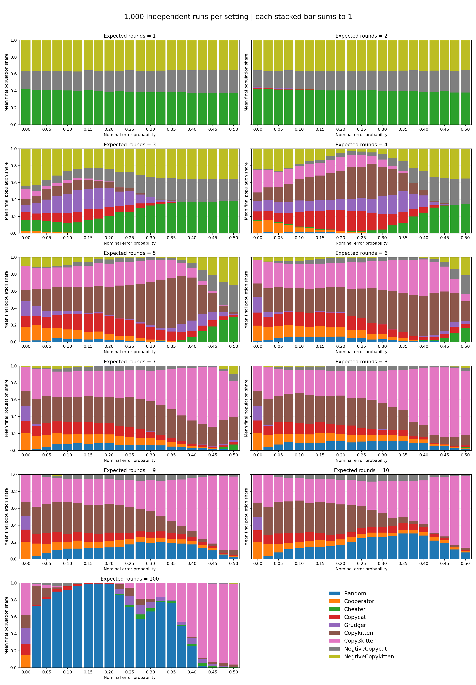
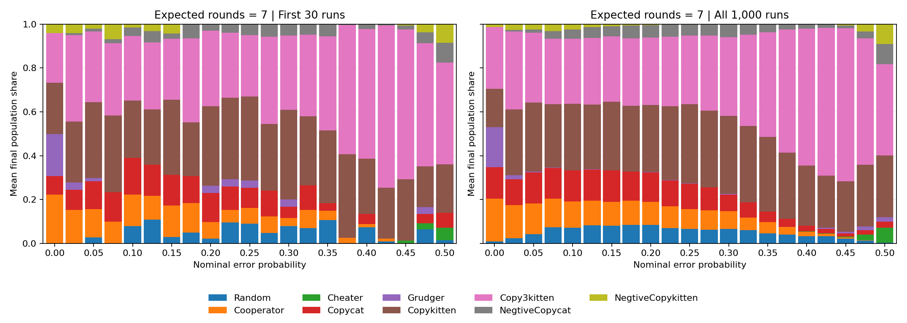

# 信任賽局：高樣本實驗報告

## 實驗結果

已完成 **231,000 次獨立演化模擬**。每組參數 1,000 次，使用 21 個錯誤率點（0–0.5，間距 0.025），以及 11 個預期互動長度（1–10、100）。

主要發現：

- 互動長度 1–2 時，Cheater、NegtiveCopykitten 與 NegtiveCopycat 占優勢，與原研究的短期互動趨勢一致。
- 「互動長度達 4 就一定由寬容策略領先」過於概括。例如長度 4、錯誤率 0.5 時，人口仍主要由背叛傾向策略組成；錯誤率會改變轉折位置。
- 長度 7、錯誤率 0.25 時，Copykitten 與 Copy3kitten 分別約占 36.1% 與 31.2%；在同樣長度、錯誤率 0.5 時，Copy3kitten 約占 41.6%。寬容程度的優勢取決於環境。
- 長度 100、錯誤率 0.1 時，Random 約占 91.9%；但零錯誤時只有 0.0%，錯誤率 0.5 時則為 0.0%。原研究觀察到的隨機策略優勢確實出現，但不是所有長期互動條件都成立。

下表列出指定條件下平均最終人口占比最高的策略；「±」是平均占比的 95% 蒙地卡羅區間半寬，單位為百分點。表內第一名只表示樣本平均最高，並不代表與第二名有顯著差異。

| 預期互動輪數 | 錯誤率 0 | 錯誤率 0.1 | 錯誤率 0.25 | 錯誤率 0.5 |
|---|---|---|---|---|
| 1 | Cheater 41.9% ± 0.7 | Cheater 40.5% ± 0.7 | Cheater 39.2% ± 0.6 | Cheater 37.3% ± 0.6 |
| 2 | Cheater 42.0% ± 0.9 | Cheater 41.6% ± 0.7 | Cheater 40.5% ± 0.7 | Cheater 38.0% ± 0.6 |
| 3 | NegtiveCopykitten 43.5% ± 2.1 | NegtiveCopykitten 26.7% ± 2.0 | NegtiveCopykitten 27.1% ± 1.2 | Cheater 37.6% ± 0.6 |
| 4 | Copy3kitten 26.9% ± 1.4 | Copykitten 25.1% ± 1.8 | Copykitten 36.7% ± 2.2 | NegtiveCopykitten 35.2% ± 0.7 |
| 5 | Copy3kitten 28.4% ± 1.6 | Copykitten 28.2% ± 1.9 | Copykitten 40.7% ± 2.2 | NegtiveCopykitten 32.8% ± 0.9 |
| 6 | Copy3kitten 27.5% ± 1.7 | Copykitten 28.5% ± 1.9 | Copykitten 34.8% ± 2.2 | Copykitten 23.4% ± 2.5 |
| 7 | Copy3kitten 28.1% ± 1.7 | Copykitten 30.4% ± 1.9 | Copykitten 36.1% ± 2.2 | Copy3kitten 41.6% ± 2.8 |
| 8 | Copy3kitten 29.5% ± 1.7 | Copykitten 35.6% ± 2.1 | Copykitten 36.0% ± 2.1 | Copy3kitten 75.4% ± 2.6 |
| 9 | Copy3kitten 32.5% ± 1.8 | Copykitten 37.0% ± 2.1 | Copy3kitten 31.8% ± 1.9 | Copy3kitten 86.9% ± 2.0 |
| 10 | Copy3kitten 33.2% ± 1.8 | Copykitten 38.2% ± 2.2 | Copy3kitten 29.8% ± 2.0 | Copy3kitten 84.6% ± 2.2 |
| 100 | Copy3kitten 37.9% ± 1.8 | Random 91.9% ± 0.5 | Random 71.6% ± 2.8 | Copy3kitten 95.4% ± 1.3 |

## 圖表與精度



沿用原圖的堆疊長條呈現方式、策略順序與配色，每根長條代表一個錯誤率，所有策略的平均最終人口占比加總為 **1（100%）**。每段高度為該策略在 1,000 次模擬中的最終個體總數，除以全部 36,000 個個體；不是勝率。橫軸每 0.025 一根長條，刻度每 0.05 顯示一次。



上圖的 30 次是本次模擬前 30 筆，屬於同一批資料的子集，作為視覺對照，不是獨立驗證。

堆疊圖呈現人口組成；各策略平均值的不確定性另見 [95% 區間曲線圖](high_sample_curves.png)（[PDF](high_sample_curves.pdf)）。曲線直接連接樣本平均，未使用人工平滑。

- 全部策略與參數點中，95% 區間最大半寬為 **3.10 個百分點**；非零標準誤的區間半寬中位數為 **0.84 個百分點**。
- 以後半樣本作為獨立參考，前 30 次的均方根差為 **2.89 個百分點**；前半樣本（500 次）降為 **1.07 個百分點**（彙整所有參數及策略）。參考組本身也有抽樣誤差。
- 固定變異數下，本次樣本數相較 30 次的標準誤約縮小 5.77 倍，相較 10 次約縮小 10.00 倍。

## 模型與解讀限制

- 使用原本九種策略，各 4 個個體；每次 100 代，每代每對個體交手一次，輪數服從 Poisson 分布，淘汰最低分 3 個並複製最高分 3 個。
- 結果是第 100 代的平均人口比例，不是每場勝率，也不是保證已達到長期平衡。個體不作為獨立樣本；標準誤由獨立模擬之間的變異估算。
- 為維持與原碼相同的模型，保留合作變背叛的單向錯誤，以及 `randint(0,100) < 100*error_rate`。實際機率為符合條件的整數個數除以 101，例如名目 0.025 實際為 3/101，名目 0.5 實際為 50/101。
- 同分時維持原有個體順序，與 Python 原始穩定排序一致。這可能產生順序效應；增加樣本無法消除模型本身的偏差。
- Copykitten / Copy3kitten 每回合檢查最近連續 2 / 3 次背叛，之後可以恢復合作；不是被觸發後永久切換策略。
- 區間採平均值的常態近似並限制在 0–100%；不是所有曲線同時成立的信賴帶。若樣本皆為零，估計標準誤也為零，不代表事件永遠不可能發生。
- 結論只適用於此人口、報酬、選擇與錯誤模型，不直接推論現實人際關係。

### 報酬與策略

| 雙方行動 | 玩家 A 得分 | 玩家 B 得分 |
|---|---:|---:|
| 合作／合作 | 2 | 2 |
| 合作／背叛 | -1 | 3 |
| 背叛／合作 | 3 | -1 |
| 背叛／背叛 | 0 | 0 |

| 策略 | 決策規則 |
|---|---|
| Random | 每回合以各 50% 機率合作或背叛 |
| Cooperator | 永遠合作 |
| Cheater | 永遠背叛 |
| Copycat | 第一回合合作，之後複製對手上一回合的行動 |
| Copykitten | 只有對手最近連續兩回合背叛時才背叛 |
| Copy3kitten | 只有對手最近連續三回合背叛時才背叛 |
| NegtiveCopycat | 第一回合背叛，之後複製對手上一回合的行動 |
| NegtiveCopykitten | 只有對手最近連續兩回合合作時才合作 |
| Grudger | 起初合作；對手一旦背叛，該次配對之後永久背叛 |

每次新配對都清除雙方記憶；表中的行動是加入錯誤之前的意圖，對手記住的是加入錯誤後的實際行動。`Negtive` 沿用原始程式的拼字，以便對照資料欄位。

## 可重現性與測試

執行方式（在專案根目錄）：

```powershell
python -m pip install -r requirements.txt
python -m unittest -v
python experiments.py
python report_results.py
```

固定主種子：`20260920`；Python 3.10.11、NumPy 1.26.4、Numba 0.61.2。每個條件與重複使用獨立種子，並保存每次最終人口計數及種子。加速器保留原模型的機率分布，並非重現舊 Python 亂數序列。

5 項測試已通過：窮舉長度 0–6 的策略歷史、405 組配對與錯誤率的原碼對照、人口守恆與固定種子及跨執行緒重現、零輪數同分排序對照、亂數種子碰撞修正。

另外完成 `--resume` 整合檢查：故意替換一筆種子與樣本，再續跑可還原原本結果。中斷後可使用 `python experiments.py --resume` 繼續，已完成且參數相符的條件會沿用。

完整資料核對已通過：231,000 個種子全域唯一；每筆人口總和皆為 36；2,079 列統計的平均、標準誤與區間均與原始樣本一致。繪圖時另外驗證每根堆疊長條的占比總和為 1，並完成 PNG 圖表目視排版檢查。

- [完整統計 CSV](../results/high_sample/summary.csv)
- [資料驗證紀錄](validation.json)
- [執行參數與版本](../results/high_sample/metadata.json)
- [比例堆疊長條圖 PDF](high_sample_stacked.pdf)
- [95% 區間曲線圖 PDF](high_sample_curves.pdf)
- 個別樣本：`results/high_sample/runs_n*_e*.npz`（`counts` 欄位順序見 metadata 的 `strategies`；每列是一個獨立模擬）。

原始 JSON 與圖檔保留，未覆寫。舊 `jsons/result.json` 每個條件人口總和為 360，相當於 36 人模型的 10 次模擬；原碼另有 30 次設定，因此不可將所有舊圖一律稱為 30 次結果。
